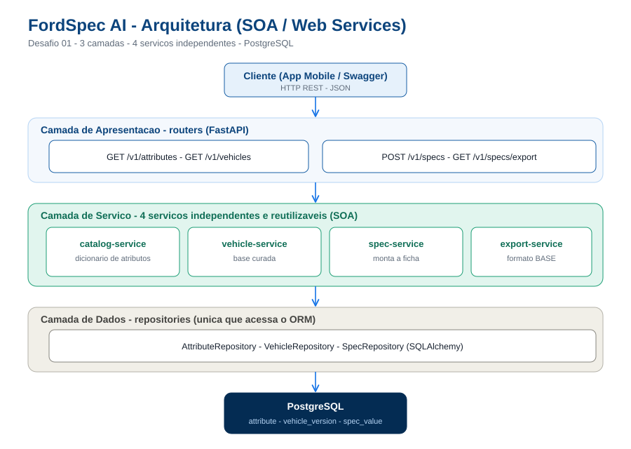

# FordSpec AI — API (Desafio 01 · Arquitetura & Web Services · Sprint 3 DevSecOps)

API REST de **Inteligência Competitiva Automotiva**. Recebe `Marca + Modelo + Versão + atributos` e devolve uma **ficha técnica padronizada** a partir de uma **base curada** com **regras determinísticas** (zero alucinação). Campos inexistentes saem como `ND`.

> **Sprint 3 (Cybersecurity/DevSecOps):** documento de entrega em
> [`docs_seguranca/SPRINT3_DevSecOps.md`](docs_seguranca/SPRINT3_DevSecOps.md): pipeline, segurança
> em código e infraestrutura, observabilidade/resposta a incidentes e compliance.

---

## Grupo 

| Nome | RM |
|------|----|
| Danilo Affonso Luz Rios | 554791 |
| Thiago Feltrin Geraldes | 555805 |
| Lucca Natario do Vale | 95688 |

## Arquitetura (SOA — serviços independentes)

```
                       API Gateway (FastAPI / prefixo /v1)
                                    │
        ┌──────────────┬────────────┴───────────┬──────────────┐
        ▼              ▼                         ▼              ▼
 catalog-service  vehicle-service          spec-service   export-service
 (dicionário de   (base curada de          (monta a       (exporta no
  atributos)       veículos)                ficha)          formato BASE)
        └──────────────┴────────────┬───────────┴──────────────┘
                                    ▼
                            PostgreSQL / SQLite
```

Diagrama completo: [`docs_seguranca/arquitetura.svg`](docs_seguranca/arquitetura.svg)



### Separação de camadas (3 camadas isoladas)
```
routers/        → APRESENTAÇÃO (HTTP, validação de entrada, status codes)
services/       → SERVIÇO      (regra de negócio determinística)
repositories/   → DADOS        (única camada que acessa o ORM)
db/             → modelos + conexão
```

---

## Como executar

```bash
# 1. dependências (inclui ferramentas de teste e segurança)
python -m venv .venv && source .venv/bin/activate     # Windows: .venv\Scripts\activate
pip install -r requirements-dev.txt

# 2. (opcional) configuração — sem .env, em dev os segredos são gerados em .dev-secrets.json
cp .env.example .env

# 3. popular a base curada e criar os usuários brigadista / gestor / administrador
#    (senhas vêm de SEED_PASSWORD_<PERFIL> ou são geradas e exibidas uma única vez)
python -m seed.seed_database

# 4. subir a API
uvicorn app.main:app --reload

# 5. documentação interativa (desligada quando APP_ENV=production)
#    Swagger UI : http://localhost:8000/docs
```

> Se houver um `fordspec.db` da Sprint 2, apague-o antes do passo 3: o schema mudou
> (tabelas `app_user` e `audit_event` e a coluna `spec_request.requested_by`). Em
> PostgreSQL, use `alembic upgrade head`.

---

## Configuração e segredos

Toda a configuração vem de variáveis de ambiente (ou de um `.env`, que nunca é versionado). Modelo: [`.env.example`](.env.example).

- Gere valores fortes (mínimo de 32 caracteres) com:
  `python -c "import secrets; print(secrets.token_urlsafe(48))"`
- Com `APP_ENV=production`, a API **não sobe** se `JWT_SECRET`, `DATA_ENC_KEYS`, `PSEUDO_SALT` ou `METRICS_TOKEN` estiverem ausentes ou fracos.
- Em desenvolvimento, segredos ausentes são gerados uma vez em `.dev-secrets.json` (ignorado pelo git); em testes (`APP_ENV=test`), são efêmeros.
- `DATA_ENC_KEYS` aceita várias chaves separadas por vírgula para **rotação**: a primeira cifra, todas decifram.
- `METRICS_TOKEN` deve ter o mesmo valor do arquivo `secrets/metrics_token.txt`, lido pelo Prometheus.
- Qualquer segredo pode ser lido de arquivo com o sufixo `_FILE` (ex.: `JWT_SECRET_FILE=/run/secrets/fordspec/JWT_SECRET`), padrão usado no Kubernetes.
- Sem `SEED_PASSWORD_<PERFIL>`, o seed gera senhas aleatórias e as exibe uma única vez.

## Ambiente completo com Docker Compose

API + PostgreSQL + MQTT/TLS (Mosquitto) + ingestão IoT + Prometheus + Alertmanager + Loki + Grafana.

```bash
cp .env.example .env                       # 1. preencher os segredos
sh scripts/gen_dev_certs.sh                # 2. CA e certificados de DESENVOLVIMENTO em infra/certs/
mkdir secrets                              # 3. segredos lidos por Prometheus e Alertmanager
echo "<mesmo METRICS_TOKEN do .env>" > secrets/metrics_token.txt
echo "https://<webhook-teams-ou-slack>" > secrets/alert_webhook_url.txt
docker compose up -d --build               # 4. sobe tudo
```

- Portas publicadas somente em `127.0.0.1`: API `8000`, Grafana `3000`, Prometheus `9090`, MQTT/TLS `8883`. A porta `1883` (MQTT sem TLS) não existe.
- Banco, broker e monitoramento ficam em redes internas, sem acesso à internet.
- O serviço `migrate` aplica as migrações Alembic e o seed antes da API subir.
- Gerar tráfego legítimo e ataques simulados para os dashboards e alertas:
  `SIM_USER=brigadista SIM_PASSWORD=<senha> python -m scripts.simulate_traffic`
- Publicar telemetria IoT de teste (normal + replay + mensagem forjada):
  `MQTT_HOST=localhost MQTT_CA=infra/certs/ca.crt MQTT_CERT=infra/certs/ranger-demo-001.crt MQTT_KEY=infra/certs/ranger-demo-001.key python -m iot.mqtt_secure_client publish --device ranger-demo-001 --ataque`

**Certificados IoT:** os gerados por `scripts/gen_dev_certs.sh` são só para desenvolvimento. Em produção, use uma PKI gerenciada (AWS IoT, Azure IoT Hub ou Vault PKI) com rotação automática. O CN do certificado de cada dispositivo é a identidade usada na ACL do broker (`infra/mosquitto/acl`): cada veículo só publica no próprio tópico. Para revogar um dispositivo, revogue o certificado na CA e regenere a CRL (`ca.crl`).

## Kubernetes

Manifests em [`k8s/`](k8s/), aplicados pelo pipeline na ordem numérica:

- `01-secret.example.yaml` é **apenas um modelo**: não aplique com valores reais versionados. Em produção os segredos vêm de um cofre (Azure Key Vault, AWS Secrets Manager ou HashiCorp Vault) via External Secrets Operator, com criptografia do etcd habilitada.
- `05-migrate-job.yaml` roda `alembic upgrade head` como Job separado, antes do rollout.
- O pipeline substitui a tag da imagem pelo digest (`@sha256`) da imagem assinada com cosign.

## Backup e recuperação

```bash
python -m scripts.backup_db backup                          # backups/fordspec-<data>.db.enc (cifrado)
python -m scripts.backup_db verify  backups/<arquivo>.enc   # teste de restauração, sem sobrescrever
python -m scripts.backup_db restore backups/<arquivo>.enc fordspec.db
```

Usa uma chave própria (`BACKUP_ENC_KEY`), grava o SHA-256 ao lado de cada arquivo e mantém os `BACKUP_RETENTION` mais recentes (padrão: 14). PostgreSQL exige o cliente `pg_dump` no PATH.

---

## Endpoints (contrato REST)

Todas as rotas `/v1/*` (exceto `/v1/auth/login` e `/v1/auth/refresh`) exigem `Authorization: Bearer <access_token>`.

| Método | Rota | Função | Perfis |
|--------|------|--------|--------|
| `POST` | `/v1/auth/login` | Autentica (access 15 min + refresh 7 dias) | — |
| `POST` | `/v1/auth/refresh` | Rotaciona o refresh token | — |
| `POST` | `/v1/auth/logout` | Encerra todas as sessões | todos |
| `GET`  | `/v1/auth/me` | Usuário e permissões | todos |
| `GET`  | `/v1/attributes` | Dicionário de atributos (14 categorias / 262 itens) | todos |
| `GET`  | `/v1/vehicles?brand=&model=` | Versões disponíveis na base curada | todos |
| `POST` | `/v1/specs` | Gera a ficha padronizada (201) | todos |
| `GET`  | `/v1/specs/{id}` | Metadados de uma ficha | dono · gestor · administrador |
| `GET`  | `/v1/specs/export?version=` | Exporta no formato BASE (CSV) | gestor · administrador |
| `GET`  | `/v1/admin/audit` | Trilha de auditoria (gestor vê só as próprias ações) | gestor · administrador |
| `GET/POST/PATCH` | `/v1/admin/users…` | Gestão de usuários e perfis | administrador |
| `GET`  | `/v1/admin/permissions/report` | Auditoria de permissões | administrador |
| `GET`  | `/v1/admin/audit/verify` | Integridade da cadeia de auditoria | administrador |
| `GET`  | `/metrics` | Métricas Prometheus (token em produção) | — |

### Exemplo — gerar ficha
```bash
TOKEN=$(curl -s -X POST http://localhost:8000/v1/auth/login -H "Content-Type: application/json" \
  -d '{"username":"brigadista","password":"<senha>"}' | python -c "import sys,json;print(json.load(sys.stdin)['access_token'])")

curl -X POST http://localhost:8000/v1/specs \
  -H "Authorization: Bearer $TOKEN" \
  -H "Content-Type: application/json" \
  -d '{
    "brand": "Ford",
    "model": "Ranger",
    "version": "Limited 3.0L V6 26MY",
    "attributes": ["Potência", "Torque", "Polegadas"]
  }'
```

### Resposta (formato padronizado — sempre igual)
```json
{
  "id": "a1b2c3...",
  "vehicle": { "brand": "Ford", "model": "Ranger", "version": "Limited 3.0L V6 26MY" },
  "generated_at": "2026-05-22T10:00:00Z",
  "total_attributes": 3,
  "items": [
    { "attribute": "Potência", "category": "Engine & Transmission", "value": "250", "unit": "cv", "status": "confirmed", "source": "Ford data sheet BASE (curado)" },
    { "attribute": "Torque", "category": "Engine & Transmission", "value": "600", "unit": "Nm", "status": "confirmed", "source": "..." }
  ]
}
```

### Erros padronizados
| Situação | Status | `error` |
|----------|--------|---------|
| Versão não existe na base | 422 | `version_not_found` |
| Atributo fora do dicionário | 400 | `invalid_attribute` |
| Ficha não encontrada (ou de outro usuário) | 404 | (HTTP padrão) |
| Sem token / token inválido, expirado ou revogado | 401 | — |
| Perfil sem permissão | 403 | — |
| Entrada inválida | 422 | `validation_error` |
| Corpo acima de 16 KB | 413 | `payload_too_large` |
| Excesso de requisições | 429 | `rate_limited` (+ `Retry-After`) |

```json
{ "error": "version_not_found",
  "message": "Versão 'Raptr' não encontrada na base curada para Ford Ranger.",
  "status": 422 }
```

---

## Banco de dados

| Tabela | Papel |
|--------|-------|
| `attribute` | Dicionário mestre (14 categorias / 262 atributos) — garante formato único |
| `vehicle_version` | Base curada (marca/modelo/versão) |
| `spec_value` | Valor de cada atributo por versão, com `status` e `source` (rastreável) |
| `spec_request` | Registro de cada ficha gerada (dono pseudonimizado) |
| `app_user` | Usuários, perfil, hash bcrypt, e-mail **cifrado**, lockout, `token_version` |
| `audit_event` | Trilha de auditoria com hash encadeado |

**Migrações:** versionadas com Alembic (`alembic revision --autogenerate` / `alembic upgrade head`). Ver `migrations/`.

---

## Testes

```bash
pytest -v --cov=app --cov=iot     # 81 testes: contrato, JWT, RBAC, BOLA, validação,
                                  # rate limit, criptografia, logs, IoT e backup
pip-audit -r requirements.txt     # SCA
bandit -r app iot scripts seed -ll -ii   # SAST
```

O pipeline [`.github/workflows/devsecops.yml`](.github/workflows/devsecops.yml) roda esses
testes e scanners, além de Gitleaks, Semgrep, Checkov, Trivy, SBOM e OWASP ZAP, em cada push/PR.

---

## Como esta API conversa com as outras disciplinas

- **Cybersecurity** → JWT seguro, RBAC Brigadista/Gestor/Administrador, criptografia local, pipeline DevSecOps, observabilidade e LGPD ([documento](docs_seguranca/SPRINT3_DevSecOps.md)).
- **Mobile/IoT** → o app React Native consome `/v1/attributes`, `/v1/vehicles` e `/v1/specs` (com Bearer token); a telemetria entra por MQTT/TLS (`iot/`).
- **IA/ML** → camada de matching de sinônimos antes do `catalog-service`.
- **Testing/QA** → `tests/` é executado como gate no pipeline.
