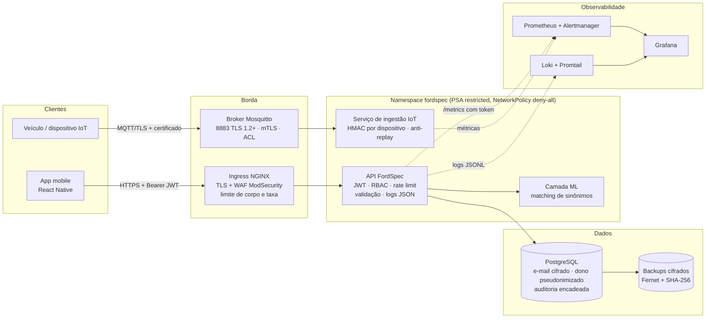
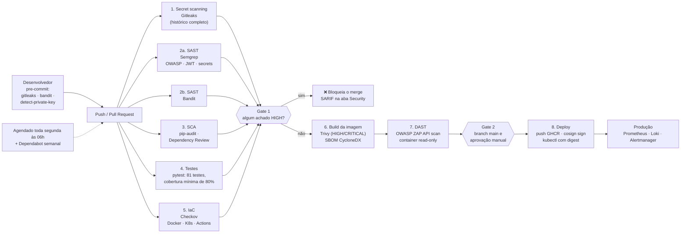
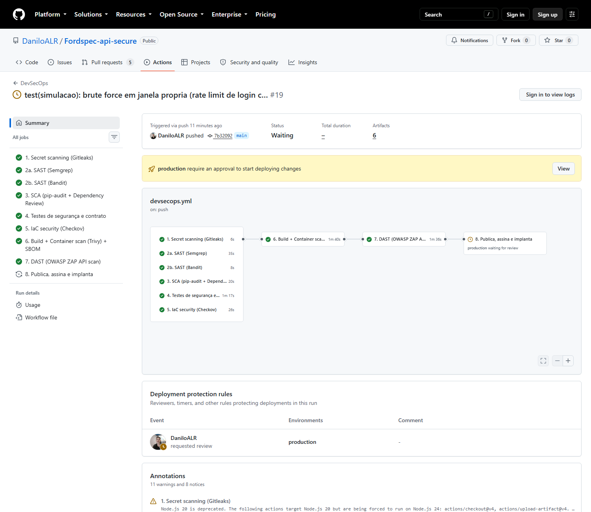
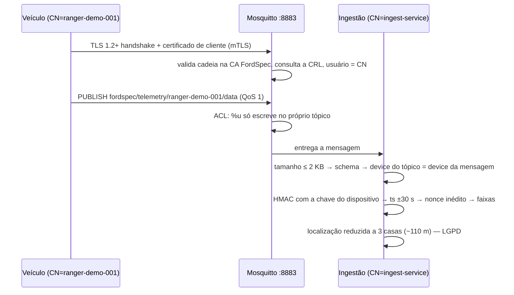
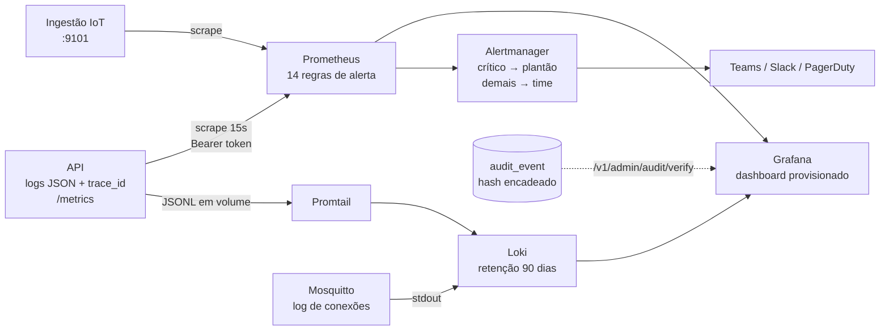
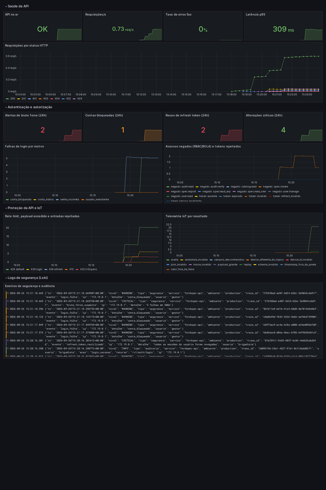
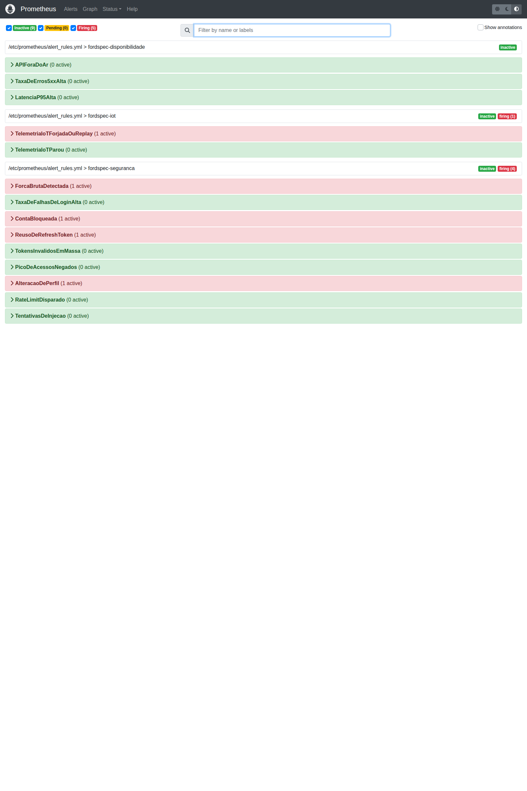
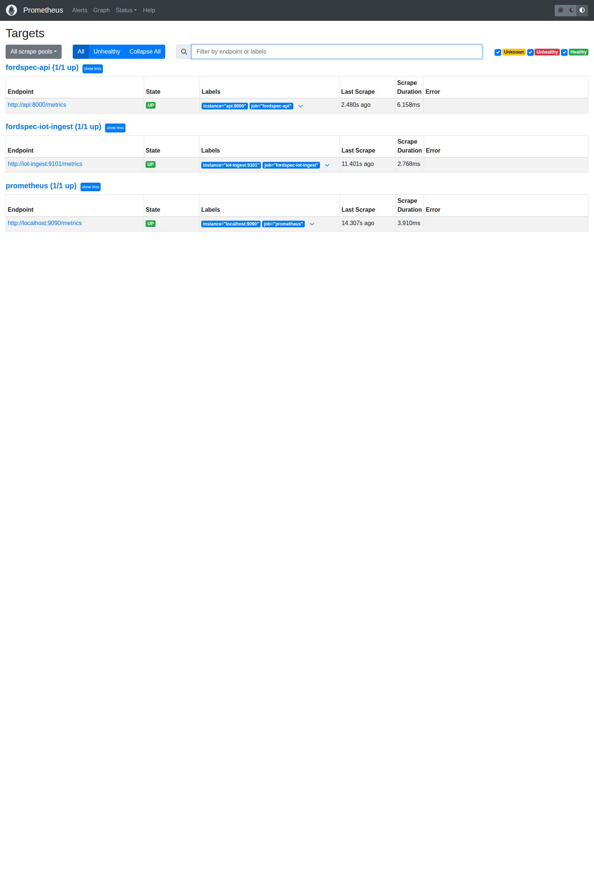
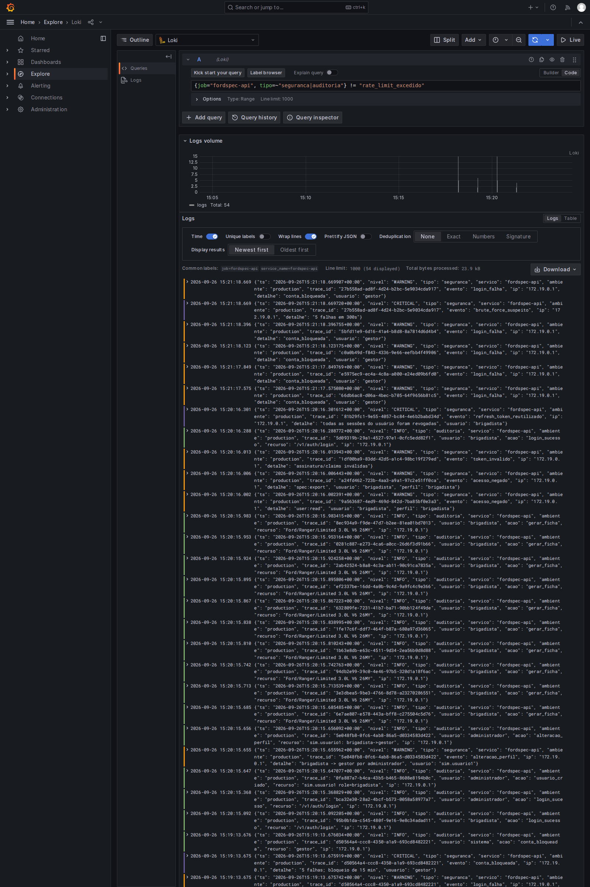
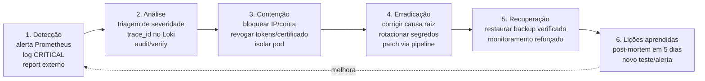

# Sprint 3 — Cybersecurity · DevSecOps no FordSpec AI

**Projeto:** FordSpec AI: API de Inteligência Competitiva Automotiva (Ford Challenge)
**Grupo:** Danilo Affonso Luz Rios (RM 554791) · Thiago Feltrin Geraldes (RM 555805) · Lucca Natario do Vale (RM 95688)
**Versão da solução:** 2.0.0 (Sprint 3), evolução da 1.1.0 (Sprint 2)

**Repositório:** <https://github.com/DaniloALR/Fordspec-api-secure> (pipeline em *Actions*)

> Este documento consolida as quatro subetapas da Sprint 3. Cada seção aponta para o
> código, a configuração e o commit que a comprovam. Todas as evidências foram
> **executadas de fato**: localmente (saídas em `docs_seguranca/`) e no GitHub Actions
> (pipeline DevSecOps e ambiente completo via `docker compose`, com prints em
> `docs_seguranca/prints/`).

## Sumário

0. [Visão geral e escopo](#0-visão-geral-e-escopo)
1. [Pipeline DevSecOps integrado (peso 3,0)](#1-pipeline-devsecops-integrado-peso-30)
2. [Segurança em código e infraestrutura (peso 2,5)](#2-segurança-em-código-e-infraestrutura-peso-25)
3. [Observabilidade, monitoramento e resposta (peso 2,0)](#3-observabilidade-monitoramento-e-resposta-peso-20)
4. [Compliance, riscos e segurança contínua (peso 2,5)](#4-compliance-riscos-e-segurança-contínua-peso-25)
5. [Anexos: como executar e evidências](#5-anexos)

---

## 0. Visão geral e escopo

### 0.1 Arquitetura da solução com os controles de segurança



### 0.2 O que mudou da Sprint 2 para a Sprint 3

| Área | Sprint 2 | Sprint 3 |
|------|----------|----------|
| Pipeline | inexistente | GitHub Actions com 9 jobs e gates de segurança |
| Dependências | 33 CVEs conhecidas em 5 pacotes | **0 CVEs** (pip-audit) |
| JWT | `python-jose` vulnerável, sem `aud/iss/jti`, refresh sem rotação | PyJWT, claims obrigatórias, rotação e revogação, logout global |
| Segredos | valores de fallback no código, senhas em dicionário | variáveis de ambiente/arquivos, produção recusa segredo fraco |
| Perfis | analista / curador / admin, verificação pelo token | **brigadista / gestor / administrador**, matriz de permissões lida do banco |
| Controle por objeto | qualquer usuário lia qualquer ficha (BOLA) | dono ou gestor/administrador |
| Criptografia | Fernet com chave fixa derivada por SHA-256 | HKDF + MultiFernet (rotação), coluna cifrada no ORM, backup cifrado |
| IoT | não existia | MQTT sobre TLS, mTLS, ACL por dispositivo, HMAC + anti-replay |
| IaC | não existia | Dockerfile, docker-compose e Kubernetes endurecidos, Checkov com 0 falhas |
| Observabilidade | log JSON sem correlação | trace_id, métricas Prometheus, 14 alertas, Grafana, Loki, auditoria à prova de adulteração |
| Testes | citados no README, mas ausentes | **81 testes automatizados**, cobertura de 90% |

### 0.3 Escopo por camada do projeto Ford

| Camada | Coberto com código neste repositório | Coberto como requisito/processo neste documento |
|--------|--------------------------------------|----------------------------------------------|
| API | sim: todo o código em `app/` | — |
| IoT | sim: `iot/`, `infra/mosquitto/`, `scripts/gen_dev_certs.sh` | PKI de produção, provisionamento de dispositivos |
| Dados | sim: modelos, migrações, criptografia, backup | classificação e retenção (LGPD, seção 4.6) |
| Arquitetura/infra | sim: `Dockerfile`, `docker-compose.yml`, `k8s/` | cofre de segredos gerenciado |
| Mobile (React Native) | não (o app fica em outro repositório) | pipeline mobile (1.4), métricas (3.3), OWASP Mobile Top 10 (4.5) |
| ML | não (o modelo de sinônimos fica em outro repositório) | pipeline ML (1.4), métricas de drift/abuso (3.3), riscos (4.1) |

---

## 1. Pipeline DevSecOps integrado (peso 3,0)

**Arquivo:** [`.github/workflows/devsecops.yml`](../.github/workflows/devsecops.yml) · **Commit:** `5777ab1`

### 1.1 Desenho do pipeline



**Gatilhos:** push e PR para `main`/`develop`, execução semanal agendada (para detectar CVEs novas em código que não mudou) e execução manual.

**Princípios aplicados no próprio workflow:**
- `permissions: contents: read` no nível global; cada job pede só a permissão extra de que precisa (`security-events: write` para SARIF, `packages: write` e `id-token: write` só no deploy).
- `concurrency` cancela execuções antigas do mesmo branch.
- Segredos de CI são efêmeros (gerados com `openssl rand` no job de DAST) e os de produção vêm de `secrets.*` do GitHub/ambiente protegido.
- O workflow também passa pelo Checkov (`framework: github_actions`): **208 verificações, 0 falhas**.

### 1.2 Etapas, ferramentas e riscos reduzidos

| # | Etapa | Ferramenta | Quando bloqueia | Risco que reduz | STRIDE / OWASP |
|---|-------|-----------|-----------------|-----------------|----------------|
| 0 | Pre-commit | gitleaks, bandit, detect-private-key | antes do commit sair da máquina | segredo commitado por engano | I · ASVS V14 |
| 1 | Secret scanning | **Gitleaks** (histórico completo) | qualquer segredo detectado | chave JWT, senha de banco ou token no Git | I, S · API8 |
| 2a | SAST | **Semgrep** (`p/python`, `p/owasp-top-ten`, `p/jwt`, `p/secrets`, `p/dockerfile`) | achado de severidade ERROR | injeção, JWT sem verificação, criptografia fraca, desserialização | T, I, E · API1–API10 |
| 2b | SAST | **Bandit** | severidade e confiança médias ou maiores | `subprocess` com shell, `assert` como controle, hash fraco, bind 0.0.0.0 | T, E |
| 3 | SCA | **pip-audit** + **Dependency Review** + **Dependabot** | CVE conhecida; PR que adiciona dependência HIGH ou licença proibida | componente vulnerável (supply chain) | T, E · API8, M2 |
| 4 | Testes de segurança | **pytest** (81 testes, cobertura ≥ 80%) | qualquer falha | regressão em JWT, RBAC, BOLA, rate limit, criptografia, IoT | todas |
| 5 | IaC | **Checkov** | qualquer falha de política | container root, capabilities, falta de NetworkPolicy, segredos em env vars | E, D · API8 |
| 6 | Container | **Trivy** + SBOM CycloneDX | CVE HIGH/CRITICAL com correção disponível | pacote vulnerável do SO/imagem base | T, E |
| 7 | DAST | **OWASP ZAP API scan** (OpenAPI) | regras marcadas como FAIL em `.zap/rules.tsv` (SQLi, XSS, CRLF, path traversal, headers) | falha só visível em execução | T, I · API8 |
| 8 | Deploy | GHCR + **cosign** (keyless/OIDC) + digest | exige aprovação no ambiente `production` | imagem adulterada, deploy não autorizado | S, T, R |

### 1.3 Como cada etapa reduz riscos, com casos reais do FordSpec

1. **Secret scanning.** Na Sprint 2, `app/security/auth.py` tinha `SECRET_KEY = os.getenv("JWT_SECRET", "troque-este-segredo-em-producao-32+chars")` e `app/routers/auth.py` guardava senhas em texto claro (`hash_password("senha-admin")`). Se a variável não fosse definida em produção, **qualquer pessoa que lesse o repositório conseguia forjar um token de administrador**. O Gitleaks (com histórico completo e `fetch-depth: 0`) e a regra `p/secrets` do Semgrep barram esse tipo de commit, e o `pre-commit` o bloqueia ainda na máquina do desenvolvedor.
2. **SAST.** O Bandit rodou no código antigo e no novo (`bandit_ANTES.txt` / `bandit_DEPOIS.txt`). Ele **não** detectou as senhas hardcoded, que ficavam dentro de chamadas de função. Por isso o pipeline combina Bandit com Semgrep e Gitleaks: uma ferramenta cobre o ponto cego da outra.
3. **SCA.** Executado: `pip-audit` no `requirements.txt` da Sprint 2 encontrou **33 vulnerabilidades em 5 pacotes** (`python-jose` com PYSEC-2024-232/233, `cryptography`, `starlette`, `python-dotenv` e `ecdsa`). Depois da atualização: **"No known vulnerabilities found"** (`pip_audit_ANTES.txt` / `pip_audit_DEPOIS.txt`, commit `7850567`). A falha em `python-jose` permitia confusão de algoritmo e DoS por token JWE comprimido, o que afeta diretamente a autenticação.
4. **Testes de segurança como gate.** Cada controle da seção 2 tem teste automatizado: `alg: none` rejeitado, token com outro segredo rejeitado, `aud` errado, reuso de refresh token, BOLA, mass assignment, 413 com corpo *chunked*, cadeia de auditoria adulterada, replay MQTT etc. Se alguém remover um controle, o pipeline quebra.
5. **IaC.** Executado localmente: o Checkov encontrou **7 falhas** na primeira versão dos manifests, todas corrigidas (commit `eebeb93`): uso de snippet NGINX (CVE-2021-25742), segredos como variáveis de ambiente, `imagePullPolicy`, tag da imagem base e digest de imagem. Resultado final: 182 + 53 + 208 verificações, **0 falhas** (`checkov_DEPOIS.txt`).
6. **Container.** O Trivy impede publicar uma imagem com CVE HIGH/CRITICAL corrigível. O SBOM CycloneDX guarda o inventário exato de cada build, o que responde em minutos à pergunta "estamos afetados pela CVE X?" (OWASP API9, gestão de inventário).
7. **DAST.** O ZAP ataca a API em execução, dentro de um container `--read-only --cap-drop ALL`, a partir do contrato OpenAPI. Isso encontra problemas que só aparecem em runtime, como header ausente ou CRLF injection.
8. **Deploy assinado.** A imagem é assinada com cosign (Sigstore, sem chave longa para vazar) e implantada **por digest**, então o cluster roda exatamente o artefato que passou pelas etapas 1 a 7.

### 1.4 Como o pipeline é executado no projeto Ford

**Fluxo de uma mudança** (exemplo: um desenvolvedor adiciona um novo filtro em `/v1/vehicles`):

1. Faz commit localmente; o `pre-commit` roda gitleaks e bandit.
2. Abre PR para `develop`; os jobs 1 a 5 rodam em paralelo (cerca de 3–5 minutos). Os achados aparecem como anotações no PR e na aba *Security* (SARIF).
3. A proteção de branch exige todos os checks verdes e 1 revisão; o *Dependency Review* comenta no PR se uma dependência nova for vulnerável.
4. Com o merge em `main`, os jobs 6 e 7 geram e testam a imagem; o job 8 aguarda **aprovação manual** do responsável (ambiente `production`), publica e assina a imagem, roda o Job de migração e faz o *rollout* com `maxUnavailable: 0`.
5. Em produção, Prometheus/Alertmanager e Loki monitoram o comportamento (seção 3). Toda segunda-feira o pipeline roda de novo e o Dependabot abre PRs de atualização.

**Configuração aplicada no repositório GitHub** (feita e verificada via API):

| Controle | Estado |
|----------|--------|
| *Branch protection* em `main` | ✅ 8 checks obrigatórios (jobs 1–7), branch atualizada antes do merge, 1 aprovação, revisões antigas descartadas em novo push, conversas resolvidas, sem *force push* e sem exclusão |
| Ambiente `production` | ✅ revisor obrigatório (aprovação manual) e deploy só a partir de `main` |
| *Secret scanning* + *push protection* | ✅ ativos (o GitHub recusa push contendo segredo conhecido) |
| Dependabot *alerts* + *security updates* | ✅ ativos (PRs automáticos de correção) |
| *Private vulnerability reporting* | ✅ ativo ([SECURITY.md](../SECURITY.md)) |
| Secret `KUBE_CONFIG` | ⏳ só quando houver cluster; sem ele o job 8 publica e assina a imagem e pula o `kubectl` |

**Extensão para as outras camadas do Ford Challenge** (repositórios próprios, mesmo modelo de gates):

| Camada | Etapas adicionais no pipeline |
|--------|-------------------------------|
| Mobile (React Native) | `npm audit` / Dependabot npm (SCA) · ESLint com `eslint-plugin-security` e Semgrep `p/react` (SAST) · **MobSF** no APK/IPA (análise estática do binário: permissões, *hardcoded keys*, `android:debuggable`) · gitleaks · assinatura do app com chave guardada no cofre do CI |
| IoT (firmware/gateway) | Semgrep/cppcheck no firmware · verificação de assinatura do firmware antes do OTA · Trivy no container do gateway · teste automatizado do broker exigindo TLS (a conexão na porta 1883 deve falhar) |
| ML | `pip-audit` nas dependências do modelo · **ModelScan** (detecta artefatos pickle maliciosos) · validação de dados de treino (schema e dados pessoais) · teste de regressão de acurácia como gate · hash do modelo registrado no SBOM |
| Dados | migrações Alembic revisadas no PR · teste automatizado de restauração de backup (`scripts/backup_db.py verify`) |

### 1.5 Evidências do pipeline

| Evidência | Situação | Arquivo |
|-----------|----------|---------|
| pip-audit antes/depois | **executado** (33 → 0) | `docs_seguranca/pip_audit_ANTES.txt`, `pip_audit_DEPOIS.txt` |
| Bandit antes/depois | **executado** (0 issues médias/altas; 1 falso positivo documentado com `nosec`) | `bandit_ANTES.txt`, `bandit_DEPOIS.txt` |
| Checkov | **executado** (7 falhas → 0) | `checkov_DEPOIS.txt` |
| pytest + cobertura | **executado** (81 passed, 90%) | `evidencias_testes.txt` |
| Pipeline completo no GitHub Actions | **executado**: jobs 1–7 verdes; job 8 aguardando aprovação no ambiente `production` | [run #19](https://github.com/DaniloALR/Fordspec-api-secure/actions/runs/36251371582) |
| OWASP ZAP (DAST) | **executado**: 78 URLs, **118 regras PASS, 0 WARN, 0 FAIL** | log do job 7 |
| Code scanning (SARIF) | **executado**: 0 alertas abertos; 3 do Trivy corrigidos; 2 do Checkov aceitos com justificativa | aba *Security* |

**Print 1:** pipeline DevSecOps no GitHub Actions. Estágios 1–7 aprovados; o deploy está bloqueado aguardando a aprovação exigida pelo ambiente `production`.



### 1.6 O que o pipeline encontrou ao ser executado de verdade

Colocar o pipeline para rodar no repositório real revelou problemas que nenhuma revisão
manual tinha pegado. Cada um virou um commit de correção (histórico em 2.7):

| # | Etapa que detectou | Achado | Correção |
|---|--------------------|--------|----------|
| 1 | **Dependabot** (alerta crítico) | `aquasecurity/trivy-action` < 0.35.0 teve a cadeia de suprimentos comprometida ([GHSA-69fq-xp46-6x23](https://github.com/advisories/GHSA-69fq-xp46-6x23)); a tag `0.28.0` usada no pipeline nem existia mais | actions de terceiros **fixadas por SHA de commit** (trivy v0.36.0, zap, cosign, checkov); alerta marcado como *fixed* (`c020218`) |
| 2 | **Trivy** (bloqueou o build) | `setuptools 70.3.0` (CVE-2025-47273, HIGH, path traversal) e `msgpack 1.1.2` vendorizado no pip (GHSA-6v7p-g79w-8964, HIGH) na imagem | pip/setuptools/ensurepip removidos da imagem final, pois o runtime não instala pacotes (`b0f453d`) |
| 3 | **OWASP ZAP** | a 1ª varredura recebeu **429** na maior parte das rotas: o próprio rate limit cegava o DAST (falso negativo) | limites relaxados **só** no container efêmero de CI (`a53673a`) |
| 4 | **OWASP ZAP** | header `Cross-Origin-Resource-Policy` ausente (regra 90004) | header adicionado, testado e promovido a regra FAIL (`a53673a`) |
| 5 | **Gitleaks** | senha literal no simulador de ataques (valor fictício, mas era credencial *hardcoded*) | senha aleatória; ocorrência histórica registrada em `.gitleaksignore` com justificativa (`9b8291c`) |
| 6 | **Gitleaks** (falha da ferramenta) | `gitleaks-action@v2` quebra no 1º push de um repositório | CLI oficial com versão fixada (`0d8bfdb`) |
| 7 | **docker compose** (workflow de evidências) | `alembic upgrade head` não encontrava o pacote `app`: **bug herdado da Sprint 2**, as migrações nunca tinham funcionado | `prepend_sys_path` + migração aplicada do zero em todo PR (`13e8720`) |
| 8 | **docker compose** | Python 3.13 ativa `VERIFY_X509_STRICT` e **recusou** a CA de dev sem `keyUsage`: a ingestão IoT não conectava ao broker | certificados com as extensões X.509 exigidas (`cac07bc`) |
| 9 | **Prometheus** (alertas) | séries rotuladas nasciam no 1º evento, `increase()` não enxergava o ataque e o alerta de **telemetria forjada não disparava** | séries pré-inicializadas em 0 (`9368b69`) |

---

## 2. Segurança em código e infraestrutura (peso 2,5)

### 2.1 Criptografia local

**Arquivos:** [`app/security/data_privacy.py`](../app/security/data_privacy.py), [`app/db/models.py`](../app/db/models.py), [`scripts/backup_db.py`](../scripts/backup_db.py) · **Commits:** `0843256`, `9cd12f0`

**Antes (Sprint 2):** chave com valor padrão no código, derivada por um único SHA-256 e sem rotação:
```python
_secret = os.getenv("DATA_ENC_KEY", "chave-de-dados-trocar-em-producao-32b")
_key = base64.urlsafe_b64encode(hashlib.sha256(_secret.encode()).digest())
_fernet = Fernet(_key)
```

**Depois:** chave obrigatória, derivada com HKDF e com **rotação** (MultiFernet):
```python
def _derivar_chave(segredo: str) -> bytes:
    hkdf = HKDF(algorithm=hashes.SHA256(), length=32, salt=None,
                info=b"fordspec-data-encryption-v1")
    return base64.urlsafe_b64encode(hkdf.derive(segredo.encode("utf-8")))

def construir_cifrador(segredos: list[str]) -> MultiFernet:
    return MultiFernet([Fernet(_derivar_chave(s)) for s in segredos])
```
Coluna cifrada **de forma transparente** no ORM, sem depender de cada desenvolvedor lembrar de cifrar:
```python
class EncryptedString(TypeDecorator):
    impl = Text
    def process_bind_param(self, value, dialect):
        return None if value is None else criptografar(value)
    def process_result_value(self, value, dialect):
        return None if value is None else descriptografar(value)

class AppUser(Base):
    email = Column(EncryptedString, nullable=True)  # cifrado em repouso
```

| Controle | Detalhe | Teste |
|----------|---------|-------|
| Confidencialidade e integridade | Fernet = AES-128-CBC + HMAC-SHA256; qualquer byte alterado gera erro | `test_adulteracao_detectada` |
| Rotação de chave | `DATA_ENC_KEYS=nova,antiga`: a nova cifra, ambas decifram; `recriptografar()` migra os dados | `test_rotacao_de_chave` |
| Dado cifrado no banco | a coluna `app_user.email` contém `gAAAAA...`; a API devolve `g****r@fordspec.local` | `test_email_cifrado_no_banco_e_mascarado_na_api` |
| Pseudonimização | `requested_by = ANON_<HMAC-SHA256>`: o banco de fichas não guarda quem pediu | `test_pseudonimizacao` |
| Senhas | bcrypt com custo 12 e verificação em tempo constante (hash *dummy* quando o usuário não existe) | `test_mensagem_generica` |
| Backup cifrado | chave própria (`BACKUP_ENC_KEY`), manifesto SHA-256, retenção, teste de restauração | `test_backup_*` (3 testes) |
| Segredos como arquivo | `NOME_FILE` (Kubernetes/Docker secrets), para não expor segredos em variáveis de ambiente | Checkov CKV_K8S_35 |

### 2.2 Hardening de API

**Arquivos:** [`app/security/protection.py`](../app/security/protection.py), [`app/security/validation.py`](../app/security/validation.py), [`app/security/auth.py`](../app/security/auth.py), [`app/main.py`](../app/main.py) · **Commits:** `5e5eb46`, `f7f5fa6`

#### a) Rate limit

| Regra | Limite | Motivo |
|-------|--------|--------|
| `POST /v1/auth/login` | 5/min por IP | brute force e credential stuffing |
| `POST /v1/auth/refresh` | 10/min por IP | abuso de sessão |
| demais rotas | 60/min por IP | scraping da base curada, que é o ativo de inteligência competitiva |

As respostas `429` trazem `Retry-After`, geram log `rate_limit_excedido` e alimentam a métrica `fordspec_rate_limited_total`. Complementos: **lockout de conta** (5 falhas → 15 min, persistido no banco, então vale para qualquer IP), **detector de brute force** por IP (janela deslizante de 5 min) e limite na borda (Ingress `limit-rps`).

#### b) Validação de entrada

- *Allowlist* por regex + bloqueio de padrões de injeção (SQLi, XSS, command injection) em marca/modelo/versão/atributos, **inclusive nos query params do export** (antes não eram validados).
- `extra="forbid"` em todos os schemas: um campo inesperado como `"role": "administrador"` gera `422` (mass assignment, API3).
- Limite de corpo: `413` acima de 16 KB, **inclusive sem `Content-Length`** (corpo *chunked*). Na primeira versão o `BaseHTTPMiddleware` do Starlette mascarava a exceção como `400`; o teste pegou o problema e o middleware passou a ser o mais interno.
- Escape de curingas do `LIKE`: antes, `GET /v1/vehicles?brand=%` **listava a base inteira**.
- `Content-Disposition` do CSV saneado (bloqueia header injection com `%0d%0a`) e proteção contra **CSV/Formula injection** (`=HYPERLINK(...)` vira `'=HYPERLINK(...)`).
- Senha acima de 72 **bytes** (bcrypt) agora gera `422`; antes derrubava a rota com erro 500.
- Erros `422` **não repetem o valor enviado**, então um payload `<script>` não volta refletido na resposta.
- Erros `500` retornam mensagem genérica com `X-Request-ID`; o detalhe fica só no log.

#### c) JWT seguro

**Antes:**
```python
from jose import jwt, JWTError              # python-jose: CVEs e sem manutenção
payload = {"sub": subject, "role": role, "type": "access", "exp": expire}
return jwt.decode(token, SECRET_KEY, algorithms=[ALGORITHM])   # sem aud/iss/jti
```
**Depois:**
```python
payload = jwt.decode(
    token, settings.jwt_secret,
    algorithms=["HS256"],                      # algoritmo fixo: bloqueia alg:none/confusão
    audience=settings.jwt_audience, issuer=settings.jwt_issuer,
    options={"require": ["exp", "iat", "nbf", "iss", "aud", "sub", "jti", "type", "role", "ver"]},
    leeway=5,
)
if denylist.revogado(payload["jti"]):
    raise RevokedTokenError(payload)
```

| Controle | Como funciona |
|----------|---------------|
| Expiração curta | access token de 15 min, refresh de 7 dias |
| Rotação do refresh | cada `/refresh` revoga o `jti` usado e emite um novo par |
| Detecção de roubo | reapresentar um refresh já usado incrementa `token_version` e **derruba todas as sessões** do usuário (alerta `ReusoDeRefreshToken`) |
| Logout global | `POST /v1/auth/logout` invalida access e refresh |
| Revogação imediata | trocar perfil ou desativar usuário incrementa `token_version`; o token antigo passa a receber `401` na próxima requisição |
| Perfil vindo do banco | o `role` do token não é confiável sozinho; a autorização usa o perfil atual do banco |
| Segredo forte obrigatório | `APP_ENV=production` sem `JWT_SECRET` de 32+ caracteres **não sobe** (`InsecureConfigError`) |

#### d) Headers e configuração

`Strict-Transport-Security`, `X-Content-Type-Options`, `X-Frame-Options: DENY`, CSP `default-src 'none'` para JSON (relaxada só em `/docs` em dev), `Permissions-Policy`, `Cross-Origin-Opener-Policy`, `Cache-Control: no-store`, `TrustedHostMiddleware`, CORS restrito (sem credenciais, métodos mínimos), `/docs` e `/openapi.json` **desligados em produção**, `uvicorn --no-server-header`.

### 2.3 Controle de acesso por perfil (Brigadista, Gestor, Administrador)

**Arquivos:** [`app/security/rbac.py`](../app/security/rbac.py), [`app/routers/admin.py`](../app/routers/admin.py) · **Commit:** `34c268f`

| Permissão | Rota(s) | Brigadista | Gestor | Administrador |
|-----------|---------|:---------:|:------:|:-------------:|
| `catalog:read` | `GET /v1/attributes`, `GET /v1/vehicles` | ✅ | ✅ | ✅ |
| `spec:create` | `POST /v1/specs` | ✅ | ✅ | ✅ |
| `spec:read_own` | `GET /v1/specs/{id}` (fichas próprias) | ✅ | ✅ | ✅ |
| `spec:read_any` | `GET /v1/specs/{id}` (qualquer ficha) | ❌ | ✅ | ✅ |
| `spec:export` | `GET /v1/specs/export` | ❌ | ✅ | ✅ |
| `audit:read` | `GET /v1/admin/audit` (gestor vê só as próprias ações) | ❌ | ✅ | ✅ |
| `user:read` | `GET /v1/admin/users`, `GET /v1/admin/permissions/report` | ❌ | ❌ | ✅ |
| `user:manage` | criar, trocar perfil, desativar, desbloquear | ❌ | ❌ | ✅ |
| `audit:verify` | `GET /v1/admin/audit/verify` | ❌ | ❌ | ✅ |

**Regras adicionais:**
- **BOLA (API1):** um brigadista que pede a ficha de outro recebe `404` (não confirma que o id existe) e o evento `bola_bloqueado` é registrado.
- **Último administrador:** nenhuma operação pode rebaixar ou desativar o último administrador ativo (`409`).
- **Usuários fora do código:** tabela `app_user` (migração `0002_security`). O seed lê `SEED_PASSWORD_<PERFIL>` ou gera uma senha aleatória exibida uma única vez. Senhas de novos usuários exigem 12+ caracteres, com letras e números.
- **Catálogo autenticado:** antes, `/v1/attributes` e `/v1/vehicles` eram públicos, o que permitia scraping anônimo do ativo principal do produto (API6).

Teste parametrizado da matriz: `TestRBAC.test_matriz_de_permissoes` (11 combinações perfil × rota), mais testes de troca de perfil, último administrador, mass assignment e BOLA.

### 2.4 Segurança MQTT/TLS para IoT

**Arquivos:** [`iot/telemetry.py`](../iot/telemetry.py), [`iot/mqtt_secure_client.py`](../iot/mqtt_secure_client.py), [`infra/mosquitto/mosquitto.conf`](../infra/mosquitto/mosquitto.conf), [`infra/mosquitto/acl`](../infra/mosquitto/acl), [`scripts/gen_dev_certs.sh`](../scripts/gen_dev_certs.sh) · **Commit:** `a1f4ff0`



**Camada de transporte (broker):**
```conf
allow_anonymous false
listener 8883                      # nenhum listener em 1883 (texto claro)
tls_version tlsv1.2                # versão mínima
require_certificate true           # mTLS obrigatório
use_identity_as_username true      # CN do certificado = identidade na ACL
crlfile /mosquitto/certs/ca.crl    # revogação de dispositivo roubado
max_packet_size 4096
```
```conf
pattern write fordspec/telemetry/%u/data   # cada veículo só publica a PRÓPRIA telemetria
pattern read  fordspec/commands/%u
```

**Cliente:** `ssl.create_default_context` com `minimum_version = TLSv1_2`, `check_hostname = True`, `CERT_REQUIRED`, certificado de cliente; a porta 1883 é recusada pelo próprio cliente.

**Camada de aplicação (ponta a ponta):** o TLS protege o canal até o broker, mas não protege contra um broker comprometido nem contra um dispositivo que usa a própria credencial para se passar por outro. Por isso cada mensagem é assinada:
- **HMAC-SHA256 com chave por dispositivo** (`HMAC(chave_mestra, device_id)`): um dispositivo invadido não consegue forjar mensagens de outros (`test_chave_de_outro_dispositivo_nao_forja`).
- **Anti-replay:** timestamp com janela de ±30 s e nonce de 128 bits em cache LRU (`test_replay_bloqueado`).
- **Validação estrita:** campos permitidos, faixas físicas (velocidade 0–300 km/h, rpm 0–9000...) e rejeição de `NaN`/booleanos; um campo como `"comando": "unlock_doors"` é rejeitado.
- **Minimização (LGPD):** coordenadas truncadas antes de qualquer armazenamento.
- **Monitoramento:** métrica `fordspec_iot_messages_total{result}` e alerta crítico para assinatura inválida ou replay (seção 3).

### 2.5 IaC Security

**Arquivos:** [`Dockerfile`](../Dockerfile), [`docker-compose.yml`](../docker-compose.yml), [`k8s/`](../k8s/) · **Commit:** `eebeb93`

| Artefato | Boas práticas aplicadas |
|----------|------------------------|
| **Dockerfile** | multi-stage (sem compilador no runtime); `python:3.13-slim-bookworm` com tag fixa; `apt-get upgrade` para correções do SO; usuário **10001 não-root**; código pertencente ao root (somente leitura para a aplicação); `PIP_NO_CACHE_DIR`; `HEALTHCHECK`; `--no-server-header`; `.dockerignore` exclui `.env`, `*.db`, certificados e `.git` |
| **docker-compose** | `read_only: true`, `cap_drop: [ALL]`, `no-new-privileges`, `tmpfs /tmp`; redes `backend`, `iot` e `monitoring` **internas** (banco sem internet); portas publicadas **só em 127.0.0.1**; Postgres com o mínimo de capabilities; `/metrics` com token via Docker secret; logs com rotação; limites de CPU e memória |
| **Kubernetes** | namespace com **Pod Security Admission `restricted`**; `runAsNonRoot`, `readOnlyRootFilesystem`, `allowPrivilegeEscalation: false`, `drop: [ALL]`, `seccompProfile: RuntimeDefault`; `automountServiceAccountToken: false`; **NetworkPolicy default-deny** com liberação só do ingress, do Prometheus, de DNS e do Postgres; segredos **montados como arquivo** (`0440`); probes com `Host` compatível com o TrustedHost; PDB, HPA, `RollingUpdate maxUnavailable: 0`; Job de migração separado; Ingress com TLS (cert-manager), ModSecurity/OWASP CRS e limite de corpo |

**Resultado do Checkov (executado):**

| Primeira versão | Correção | Final |
|-----------------|----------|-------|
| CKV_K8S_153: snippet NGINX (CVE-2021-25742) | removido; `/metrics` protegido por token e NetworkPolicy | ✅ |
| CKV_K8S_35 (×2): segredos em variáveis de ambiente | suporte a `NOME_FILE` na config + volume de secret | ✅ |
| CKV_K8S_15: `imagePullPolicy` do Job | `Always` | ✅ |
| CKV_DOCKER_7: tag da imagem base via `ARG` | tag explícita | ✅ |
| CKV_K8S_43 (×2): imagem sem digest | pipeline injeta `@sha256` no deploy (skip justificado na anotação) | ✅ |

### 2.6 Vulnerabilidades encontradas e corrigidas

| # | Vulnerabilidade (Sprint 2) | Severidade | Como foi encontrada | Correção | Commit |
|---|---------------------------|-----------|---------------------|----------|--------|
| 1 | 33 CVEs em dependências (python-jose, cryptography, starlette, dotenv, ecdsa) | Alta | pip-audit | versões corrigidas + PyJWT | `7850567` |
| 2 | Segredos JWT/cripto/HMAC com fallback hardcoded | Crítica | revisão de código + Gitleaks | config central que recusa segredo fraco | `a06219d` |
| 3 | Senhas de usuários no código-fonte | Crítica | revisão de código | tabela `app_user` + seed via ambiente | `34c268f` |
| 4 | Credenciais `user:pass` no `alembic.ini` | Média | revisão de código | URL lida de `DATABASE_URL` | `a06219d` |
| 5 | BOLA em `GET /v1/specs/{id}` | Alta | threat model (API1) | verificação de dono | `34c268f` |
| 6 | JWT sem `aud/iss/jti`, refresh sem rotação | Média | revisão (ASVS V3) | claims obrigatórias, rotação, revogação | `5e5eb46` |
| 7 | Perfil lido só do token (rebaixar usuário não tinha efeito imediato) | Média | teste de troca de perfil | perfil + `token_version` vindos do banco | `34c268f` |
| 8 | Wildcard `%` no `ilike` listava a base inteira | Média | teste de fuzzing | escape de `%`, `_` e `\` | `34c268f` |
| 9 | Header injection no `Content-Disposition` do export | Média | teste com `%0d%0a` | sanitização + filename seguro | `f7f5fa6` |
| 10 | CSV/Formula injection no export | Baixa | revisão | prefixo `'` | `f7f5fa6` |
| 11 | Senha > 72 bytes causava erro 500 (bcrypt 5) | Baixa | teste | validação em bytes | `5e5eb46` |
| 12 | Sem limite de corpo (DoS) | Média | threat model (API4) | 413, inclusive chunked | `f7f5fa6` |
| 13 | Login sem limite próprio / sem lockout | Alta | threat model | 5/min + lockout de conta | `5e5eb46`, `f7f5fa6` |
| 14 | Catálogo público (scraping do ativo) | Média | threat model (API6) | autenticação obrigatória | `34c268f` |
| 15 | Enumeração de usuário por tempo de resposta | Baixa | revisão | bcrypt com hash *dummy* | `5e5eb46` |
| 16 | 7 falhas de IaC | Média | Checkov | ver 2.5 | `eebeb93` |
| 17 | Action de terceiros com supply chain comprometida (trivy-action < 0.35) | Crítica | Dependabot | pin por SHA de commit | `c020218` |
| 18 | setuptools/msgpack vulneráveis na imagem | Alta | Trivy | pip/setuptools removidos do runtime | `b0f453d` |
| 19 | Migrações Alembic nunca executavam (herdado da Sprint 2) | Média | docker compose | `prepend_sys_path` + teste no pipeline | `13e8720` |
| 20 | Header CORP ausente | Baixa | OWASP ZAP | header + regra FAIL | `a53673a` |
| 21 | DAST cego pelo rate limit (falso negativo) | Média | análise do log do ZAP | limites relaxados só no CI | `a53673a` |
| 22 | Alerta de ataque IoT não disparava | Média | workflow de evidências | séries pré-inicializadas | `9368b69` |

### 2.7 Histórico de commits (evidência)

```text
# correções guiadas pelo pipeline rodando no GitHub (seção 1.6)
7b32092 test(simulacao): brute force em janela propria (rate limit de login consumia os chutes)
9b8291c fix(secrets): Gitleaks barrou senha literal no simulador; senha passa a ser aleatoria
9368b69 fix(observability): pre-inicializa series de metricas e amplia a simulacao de ataques
c85018c fix(compose): healthcheck proprio para o servico de ingestao IoT (herdava o da API)
cac07bc fix(iot): certificados de dev com extensoes X.509 exigidas pela verificacao estrita
13e8720 fix(migrations): alembic nao encontrava o pacote app (prepend_sys_path)
3b813db ci(evidencias): workflow que sobe o compose completo, simula ataques e captura prints
a53673a fix(dast): ZAP bloqueado pelo proprio rate limit; adiciona Cross-Origin-Resource-Policy
b0f453d fix(container): remove pip/setuptools/ensurepip da imagem final
c020218 ci: fixa actions de terceiros por SHA de commit (trivy, zap, cosign, checkov)
0d8bfdb ci: executa Gitleaks via CLI oficial (a action falha no primeiro push do repositorio)
0400400 docs: documento consolidado da Sprint 3 (DevSecOps), STRIDE revisado, evidencias e README
# melhorias de código e infraestrutura
5777ab1 ci(devsecops): pipeline com Gitleaks, Semgrep, Bandit, pip-audit, Checkov, Trivy, SBOM, ZAP e deploy assinado
eebeb93 feat(iac): Dockerfile endurecido, docker-compose seguro e manifests Kubernetes
fd0ef59 feat(observability): Prometheus, alertas, Alertmanager, Loki/Promtail e dashboard Grafana
9cd12f0 feat(backup): rotina de backup e restauracao cifrada com verificacao e retencao
a1f4ff0 feat(iot): telemetria MQTT sobre TLS com mTLS, ACL por dispositivo e mensagens assinadas
d32043a test: suite de seguranca e contrato (66 testes) + relatorios Bandit
a1fd008 feat(observability): logs JSON com trace_id, metricas Prometheus e auditoria encadeada
f7f5fa6 feat(hardening): rate limit por rota, limite de payload e erros sem stack trace
0843256 feat(crypto): criptografia local com HKDF, rotacao de chaves e coluna cifrada
34c268f feat(rbac): perfis Brigadista/Gestor/Administrador e controle por objeto
5e5eb46 feat(auth): JWT seguro com claims obrigatorias, rotacao e revogacao
a06219d feat(secrets): configuracao central sem segredos hardcoded
7850567 fix(sca): atualiza dependencias vulneraveis e troca python-jose por PyJWT
ea822df chore: baseline Sprint 2 (API segura FordSpec)
```
`git diff ea822df..HEAD` mostra o antes/depois completo.

---

## 3. Observabilidade, monitoramento e resposta (peso 2,0)

### 3.1 Arquitetura de observabilidade



Tudo está versionado em [`observability/`](../observability/) e sobe com `docker compose up` (Grafana em `127.0.0.1:3000`, com dashboard e datasources provisionados).

### 3.2 Logs estruturados

**Formato:** uma linha JSON por evento (`app/security/audit.py`), em stdout e opcionalmente em arquivo JSONL com rotação.

| Campo | Descrição |
|-------|-----------|
| `ts` | ISO 8601 em UTC |
| `nivel` | INFO / WARNING / ERROR / CRITICAL |
| `tipo` | `acesso`, `auditoria`, `seguranca`, `erro` |
| `trace_id` | igual ao header `X-Request-ID`; correlaciona todos os logs de uma requisição |
| `evento` / `acao` | o que aconteceu |
| `usuario`, `perfil`, `ip` | quem e de onde (usuário inexistente é pseudonimizado) |
| `detalhe`, `recurso` | contexto |

**Proteções no próprio log:** chaves com `senha`, `password`, `token`, `secret` ou `authorization` são descartadas antes de gravar (`test_log_estruturado_sem_segredos`); a serialização JSON impede *log injection* com quebra de linha.

**Eventos registrados:**

| Categoria | Eventos |
|-----------|---------|
| Login | `login_sucesso`, `login_falha` (com motivo: senha_incorreta, usuario_inexistente, conta_bloqueada, conta_inativa), `conta_bloqueada`, `brute_force_suspeito`, `logout` |
| Sessão | `token_invalido`, `refresh_token_reutilizado` |
| Autorização | `acesso_negado`, `bola_bloqueado` |
| Alterações críticas | `usuario_criado`, `alteracao_perfil`, `usuario_desativado`, `usuario_desbloqueado`, `exportar_ficha` |
| Proteção | `rate_limit_excedido`, `payload_excedido`, `erro_nao_tratado` |
| IoT | `telemetria_aceita`, `telemetria_rejeitada` (motivo) |

**Exemplos reais**, gerados por um cenário de ataque simulado (arquivo completo: [`exemplos_logs.jsonl`](exemplos_logs.jsonl)):

```json
{"ts": "2026-09-25T14:17:39.500176+00:00", "nivel": "WARNING", "tipo": "seguranca", "evento": "acesso_negado", "ip": "200.160.2.10", "detalhe": "spec:export", "usuario": "brigadista", "perfil": "brigadista", "trace_id": "e2da10bb-6acb-410a-ad22-811bbca4007d"}
{"ts": "2026-09-25T14:17:40.610748+00:00", "nivel": "CRITICAL", "tipo": "seguranca", "evento": "brute_force_suspeito", "ip": "185.220.101.7", "detalhe": "5 falhas em 300s", "trace_id": "98a1b6cc-ff5a-4acd-b125-c39e71533e4f"}
{"ts": "2026-09-25T14:17:40.611070+00:00", "nivel": "CRITICAL", "tipo": "seguranca", "evento": "conta_bloqueada", "ip": "185.220.101.7", "detalhe": "5 falhas; bloqueio de 15 min", "usuario": "gestor", "trace_id": "98a1b6cc-ff5a-4acd-b125-c39e71533e4f"}
{"ts": "2026-09-25T14:17:40.629730+00:00", "nivel": "WARNING", "tipo": "seguranca", "evento": "rate_limit_excedido", "ip": "185.220.101.7", "detalhe": "regra=login limite=5/min"}
{"ts": "2026-09-25T14:17:40.655900+00:00", "nivel": "CRITICAL", "tipo": "seguranca", "evento": "refresh_token_reutilizado", "ip": "200.160.2.10", "detalhe": "todas as sessões do usuário foram revogadas", "usuario": "brigadista"}
{"ts": "2026-09-25T14:17:40.681315+00:00", "nivel": "WARNING", "tipo": "seguranca", "evento": "alteracao_perfil", "ip": "200.160.2.10", "detalhe": "gestor -> brigadista por administrador", "usuario": "gestor"}
{"ts": "2026-09-25T14:17:39.508485+00:00", "nivel": "INFO", "tipo": "acesso", "metodo": "POST", "rota": "/v1/specs", "status": 422, "duracao_ms": 3.89, "ip": "200.160.2.10", "usuario": "brigadista"}
```
*(campos `servico` e `ambiente` omitidos aqui por espaço.)*

**Trilha de auditoria à prova de adulteração (não repúdio):** eventos críticos também vão para a tabela `audit_event`, com `hash = SHA-256(prev_hash | ts | ator | ação | recurso | ip)`. Se alguém com acesso ao banco alterar ou apagar um registro para esconder o que fez, `GET /v1/admin/audit/verify` responde `{"integra": false, "registro_adulterado": <id>}` (`test_cadeia_de_auditoria_detecta_adulteracao`).

### 3.3 Métricas e alertas por camada

| Camada | Métrica | Alerta (regra) | Severidade |
|--------|---------|----------------|-----------|
| **API · autenticação** | `fordspec_auth_login_failures_total{reason}` | `TaxaDeFalhasDeLoginAlta` (> 30/min por 2 min) | warning |
| | `fordspec_security_brute_force_alerts_total` | `ForcaBrutaDetectada` | critical |
| | `fordspec_auth_account_lockouts_total` | `ContaBloqueada` | warning |
| | `fordspec_auth_refresh_reuse_total` | `ReusoDeRefreshToken` | critical |
| | `fordspec_auth_token_rejected_total{reason}` | `TokensInvalidosEmMassa` (> 20 em 5 min) | warning |
| **API · autorização** | `fordspec_authz_denied_total{permission}` | `PicoDeAcessosNegados` (> 20 em 5 min) | warning |
| | `fordspec_critical_changes_total{action}` | `AlteracaoDePerfil` | info |
| **API · proteção** | `fordspec_rate_limited_total{rule}` | `RateLimitDisparado` (> 60/min por 5 min) | warning |
| | `fordspec_input_rejected_total{route}` | `TentativasDeInjecao` (> 50 em 5 min) | warning |
| | `fordspec_payload_too_large_total` | painel | — |
| **API · disponibilidade** | `up`, `fordspec_http_requests_total{status}`, `fordspec_http_request_duration_seconds` | `APIForaDoAr`, `TaxaDeErros5xxAlta` (> 5%), `LatenciaP95Alta` (> 1 s) | critical / warning |
| **IoT** | `fordspec_iot_messages_total{result}` | `TelemetriaIoTForjadaOuReplay`, `TelemetriaIoTParou` (15 min) | critical / warning |
| **Mobile** *(app RN, via Sentry/Firebase Crashlytics)* | taxa de crash, falhas de *certificate pinning*, detecção de root/jailbreak, versão do app | pico de falha de pinning (possível MITM); uso de versão com vulnerabilidade conhecida | critical / warning |
| **ML** *(serviço de matching)* | confiança média do matching, taxa de "ND", distribuição das entradas, volume de consultas por usuário | queda de confiança/drift (> 2σ da linha de base); consultas em massa por um usuário (tentativa de extrair o modelo) | warning |

As regras ficam em [`observability/prometheus/alert_rules.yml`](../observability/prometheus/alert_rules.yml); cada uma tem o rótulo `playbook` apontando para a seção 3.5. O roteamento fica em [`alertmanager.yml`](../observability/alertmanager/alertmanager.yml): alertas críticos vão para o plantão a cada 30 min, os demais para o time a cada 4 h.

### 3.4 Dashboards

Dashboard provisionado: **FordSpec — Segurança e Operação** ([`fordspec-security.json`](../observability/grafana/dashboards/fordspec-security.json)).

| Linha | Painéis |
|-------|---------|
| Saúde da API | API no ar · requisições/s · taxa de 5xx · latência p95 · requisições por status |
| Autenticação e autorização | brute force (24 h) · contas bloqueadas (24 h) · reuso de refresh (24 h) · alterações críticas (24 h) · falhas de login por motivo · acessos negados e tokens rejeitados |
| Proteção da API e IoT | 429/413/422 por regra/rota · telemetria IoT por resultado |
| Logs de segurança (Loki) | `{job="fordspec-api", tipo=~"seguranca|auditoria|erro"} != "rate_limit_excedido"` |

**Como os prints abaixo foram gerados.** O workflow [`observability-evidence.yml`](../.github/workflows/observability-evidence.yml) roda no GitHub Actions e faz, de forma reprodutível:
1. gera segredos efêmeros, `.env` e a CA/certificados de dev;
2. sobe o `docker compose` completo em modo **produção** (Postgres, migração + seed, API, Mosquitto com mTLS, ingestão IoT, Prometheus, Alertmanager, Loki, Promtail, Grafana);
3. roda [`scripts/simulate_traffic.py`](../scripts/simulate_traffic.py): tráfego legítimo, injeção, escalonamento de privilégio, token `alg:none`, reuso de refresh token, alteração de perfil, brute force e flood;
4. publica telemetria real por MQTT/TLS (20 mensagens) seguida de um **replay** e de uma **mensagem forjada**, e confirma que a porta 1883 (sem TLS) não existe;
5. captura os prints com Playwright e exporta os alertas disparados.

Para reproduzir localmente: `docker compose up -d --build` e `SIM_USER=brigadista SIM_PASSWORD=<senha> python -m scripts.simulate_traffic`, depois abrir `http://127.0.0.1:3000`.

**Alertas disparados durante a simulação** ([`alertas_prometheus.json`](prints/alertas_prometheus.json)):

| Alerta | Severidade | Playbook | Ataque simulado |
|--------|-----------|----------|-----------------|
| `ForcaBrutaDetectada` | critical | PB-01 | 8 senhas erradas para `gestor` a partir do mesmo IP |
| `ContaBloqueada` | warning | PB-01 | lockout de `gestor` após 5 falhas |
| `ReusoDeRefreshToken` | critical | PB-02 | refresh token já usado reapresentado |
| `AlteracaoDePerfil` | info | PB-03 | administrador promove usuário a gestor |
| `TelemetriaIoTForjadaOuReplay` | critical | PB-06 | replay e mensagem com assinatura inválida via MQTT |

Os demais alertas ficaram inativos, como esperado: os limiares de pico (> 20 acessos negados, > 50 injeções, 5xx > 5%) não são atingidos por uma simulação curta, e a API não caiu.

**Print 2:** dashboard *FordSpec — Segurança e Operação* durante a simulação. Aparecem 2 alertas de brute force, 1 conta bloqueada, 2 reusos de refresh, 4 alterações críticas, 429 por regra, 422 em `/v1/specs`, 20 telemetrias aceitas + replay + assinatura inválida, e os logs de segurança no Loki.



**Print 3:** Prometheus → *Alerts*, com os alertas disparados (vermelho) agrupados por regra.



**Print 4:** Prometheus → *Targets*: API (com token no `/metrics`), ingestão IoT e o próprio Prometheus coletados.



**Print 5:** Grafana Explore/Loki com eventos de segurança e auditoria (brute force, conta bloqueada, reuso de refresh, alteração de perfil), sem o ruído de 429.



Amostra dos logs reais do ambiente compose (um de cada evento, incluindo a ingestão IoT rejeitando `replay` e `assinatura_invalida`): [`logs_amostra_compose.jsonl`](prints/logs_amostra_compose.jsonl).

### 3.5 Plano de resposta a incidentes

Baseado no NIST SP 800-61, no fluxo pedido: **detecção → análise → contenção → erradicação → recuperação** (+ lições aprendidas).



**Papéis:** *Incident Commander* (líder técnico de plantão), *Analista de segurança*, *Responsável pela aplicação*, *Encarregado de dados (DPO)* e *Comunicação* (Ford).

**Severidade e SLA:**

| Nível | Exemplo | Tempo de resposta | Escalonamento |
|-------|---------|-------------------|---------------|
| SEV1 · Crítico | vazamento de segredo/dados, roubo de sessão confirmado, dispositivo IoT clonado | 15 min | IC + DPO + Ford imediatamente |
| SEV2 · Alto | brute force ativo, pico de BOLA/403, API fora do ar | 1 h | IC |
| SEV3 · Médio | conta bloqueada, pico de 429, latência alta | 4 h | time |
| SEV4 · Baixo | alerta informativo (troca de perfil esperada) | próximo dia útil | — |

**Playbooks** (o rótulo `playbook` de cada alerta aponta para um deles):

| | PB-01 Brute force / credential stuffing | PB-02 Roubo de sessão / segredo JWT vazado | PB-03 Escalonamento de privilégio / BOLA |
|---|---|---|---|
| **Detecção** | `ForcaBrutaDetectada`, `TaxaDeFalhasDeLoginAlta`, `ContaBloqueada` | `ReusoDeRefreshToken`, `TokensInvalidosEmMassa`, Gitleaks/secret scanning | `PicoDeAcessosNegados`, `AlteracaoDePerfil`, evento `bola_bloqueado` |
| **Análise** | Loki: `{tipo="seguranca"} \|= "login_falha"` agrupado por `ip` e `usuario`; um IP (ataque direcionado) ou muitos (stuffing)? Houve `login_sucesso` do mesmo IP depois? | `trace_id` do alerta → IP, usuário e horário; comparar com o padrão do usuário; o segredo aparece no Git ou em log? | `GET /v1/admin/audit` + `audit/verify`: a troca de perfil foi feita por quem? A cadeia está íntegra? |
| **Contenção** | lockout automático já ativo; bloquear IP/ASN no WAF (Ingress); se houve login indevido: `POST /v1/admin/users/{u}/deactivate` | reuso já revoga as sessões do usuário automaticamente; segredo vazado: **trocar `JWT_SECRET`** (invalida todos os tokens) | desativar a conta suspeita; reverter o perfil (`PATCH .../role`), o que também revoga os tokens dela |
| **Erradicação** | forçar troca de senha; avaliar MFA para gestor/administrador | remover o segredo do histórico (`git filter-repo`), revisar como vazou e adicionar regra no Gitleaks | corrigir a falha de autorização, adicionar teste na matriz RBAC e fazer deploy pelo pipeline |
| **Recuperação** | `POST .../unlock` após a validação do usuário; monitorar por 48 h | novo segredo via cofre; confirmar que as métricas voltaram ao normal | restaurar dados alterados a partir de backup verificado, se necessário |

| | PB-04 Scraping / DoS / injeção | PB-05 Indisponibilidade / erro 5xx | PB-06 Dispositivo IoT comprometido |
|---|---|---|---|
| **Detecção** | `RateLimitDisparado`, `TentativasDeInjecao`, alertas do WAF | `APIForaDoAr`, `TaxaDeErros5xxAlta`, `LatenciaP95Alta` | `TelemetriaIoTForjadaOuReplay`, `TelemetriaIoTParou` |
| **Análise** | origem (IP/usuário), rotas e padrão dos payloads no log de acesso | `erro_nao_tratado` no Loki pelo `trace_id` informado pelo usuário; o deploy é recente? | `telemetria_rejeitada` por `device_topico` e `motivo`; o certificado do dispositivo foi usado de onde? |
| **Contenção** | reduzir o `limit-rps` no Ingress; bloquear o IP; desativar o usuário autenticado que estiver fazendo scraping | `kubectl rollout undo` (volta para a imagem assinada anterior) | **revogar o certificado** (CRL) e remover o dispositivo da ACL; o broker recusa a próxima conexão |
| **Erradicação** | ajustar a validação/regra do WAF; adicionar teste | corrigir o bug, adicionar teste de regressão e publicar pelo pipeline | reprovisionar o dispositivo com novo certificado; rotacionar `IOT_HMAC_MASTER_KEY` se a chave mestra estiver exposta |
| **Recuperação** | voltar os limites ao normal | validar SLO por 24 h | descartar a telemetria do período comprometido; religar o dispositivo |

**Obrigações LGPD em incidentes com dados pessoais:** o DPO avalia o risco aos titulares. Se houver risco ou dano relevante, comunica a **ANPD** e os titulares (art. 48 da LGPD; Resolução CD/ANPD nº 15/2024: prazo de **3 dias úteis**), informando a natureza dos dados, os titulares afetados, as medidas técnicas adotadas e os riscos. Evidências (logs do Loki, export da `audit_event`, `trace_id`s) são preservadas em cópia somente leitura.

**Exercícios:** simulação trimestral (*tabletop*) de um playbook usando `scripts/simulate_traffic.py`, medindo MTTD e MTTR.

---

## 4. Compliance, riscos e segurança contínua (peso 2,5)

### 4.1 Revisão final dos riscos (STRIDE)

Status: ✅ mitigado · 🟡 parcialmente mitigado (risco residual aceito ou dependente de outro componente).

| STRIDE | Ameaça no FordSpec | Componente | Mitigação (Sprint 3) | Status |
|--------|-------------------|-----------|----------------------|--------|
| **S**poofing | forjar JWT de administrador | API | segredo forte obrigatório, algoritmo fixo, `aud/iss` obrigatórios | ✅ |
| | roubo/reuso de refresh token | API/Mobile | rotação + detecção de reuso + logout global | ✅ |
| | brute force / credential stuffing | API | rate limit 5/min, lockout, alerta, WAF | ✅ |
| | veículo falso publicando telemetria | IoT | mTLS + CRL + HMAC por dispositivo | ✅ |
| **T**ampering | injeção em parâmetros | API | allowlist + padrões + ORM parametrizado + escape de LIKE | ✅ |
| | adulteração de telemetria em trânsito | IoT | TLS 1.2+ e HMAC ponta a ponta | ✅ |
| | imagem ou dependência adulterada | Pipeline | SCA, Trivy, SBOM, cosign, deploy por digest | ✅ |
| | alteração de dados cifrados | Dados | Fernet autenticado (HMAC) | ✅ |
| **R**epudiation | "não fui eu que alterei o perfil" | API/Dados | auditoria com hash encadeado, `trace_id`, IP | ✅ |
| | apagar logs para esconder ataque | Observabilidade | Loki com retenção de 90 dias fora do pod + cadeia no banco | 🟡 (ideal: armazenamento WORM) |
| **I**nformation Disclosure | stack trace / eco de payload | API | 500 genérico, 422 sem o valor enviado | ✅ |
| | segredo no Git ou em variável de ambiente | Pipeline/Infra | Gitleaks, pre-commit, secrets como arquivo | ✅ |
| | vazamento do banco (e-mail, localização) | Dados | coluna cifrada, pseudonimização, minimização | ✅ |
| | BOLA: ler ficha de outro usuário | API | verificação de dono + 404 | ✅ |
| | scraping da base curada | API | catálogo autenticado + rate limit | ✅ |
| | extração do modelo de ML por consultas em massa | ML | rate limit por usuário + alerta de volume | 🟡 (requer o serviço ML) |
| **D**enial of Service | flood / corpo gigante | API | rate limit, 413, limites de recurso no k8s, HPA | ✅ |
| | flood MQTT | IoT | `max_packet_size`, `max_connections`, `max_inflight` | ✅ |
| | rate limit em memória com várias réplicas | API | cada réplica limita separadamente (o limite efetivo é N×) | 🟡 (migrar para Redis) |
| **E**levation of Privilege | brigadista acessando rotas de gestor/admin | API | matriz de permissões + teste parametrizado | ✅ |
| | mass assignment (`"role": "administrador"`) | API | `extra="forbid"` | ✅ |
| | perfil antigo em token ainda válido | API | perfil + `token_version` lidos do banco | ✅ |
| | escape do container | Infra | não-root, read-only, drop ALL, seccomp, PSA restricted | ✅ |

### 4.2 Riscos específicos de DevSecOps

| Risco | Cenário | Controle |
|-------|---------|----------|
| Pipeline comprometido | action de terceiros maliciosa rouba segredos do CI | `permissions` mínimas por job; Dependabot para actions; segredos de produção só no ambiente protegido. Recomendação: fixar actions por SHA |
| Segredo em log de CI | `echo $SECRET` | GitHub mascara secrets; segredos de DAST são efêmeros; `kubeconfig` removido ao fim do job |
| Bypass dos gates | merge direto em `main` | branch protection com checks obrigatórios e revisão; deploy com aprovação manual |
| Falso negativo das ferramentas | o Bandit não pegou as senhas hardcoded | defesa em camadas (Semgrep + Gitleaks + testes + revisão) |
| Falso positivo gera fadiga | desenvolvedores passam a ignorar achados | `nosec` só com justificativa; `.gitleaks.toml`/`.zap/rules.tsv` versionados e revisados |
| Dependência abandonada | caso do `python-jose` | SCA semanal + critério de manutenção ativa na escolha de bibliotecas |
| Drift entre IaC e produção | alteração manual no cluster | deploy só pelo pipeline; `kubectl diff` na revisão mensal |

### 4.3 Mapeamento OWASP ASVS (v4.0.3, nível 2)

| Capítulo ASVS | Requisito (resumo) | Implementação | Evidência |
|---------------|--------------------|---------------|-----------|
| V1 Arquitetura | modelagem de ameaças, segregação de componentes | STRIDE (4.1), 3 camadas, redes/NetworkPolicy | este documento, `k8s/04-networkpolicy.yaml` |
| V2 Autenticação | 2.1.1 senha ≥ 12 caracteres | `UserCreateIn` (12+ caracteres, letras e números) | `validation.py::_validar_senha_forte` |
| | 2.2.1 anti-automação (brute force) | rate limit + lockout | `test_rate_limit_login`, `test_lockout_e_desbloqueio` |
| | 2.4.1 armazenamento de senha resistente | bcrypt com custo 12 | `auth.py` |
| V3 Sessão | 3.3.1 logout invalida a sessão | `token_version` | `test_logout_revoga_sessoes` |
| | 3.5.3 tokens stateless assinados e validados | PyJWT com claims obrigatórias | `TestJWT` (10 testes) |
| V4 Controle de acesso | 4.1.3 menor privilégio | matriz de permissões | `test_matriz_de_permissoes` |
| | 4.2.1 proteção contra IDOR/BOLA | verificação de dono | `test_brigadista_nao_le_ficha_de_outro` |
| V5 Validação | 5.1.3 validação por allowlist | `sanitizar_texto`, Pydantic `extra=forbid` | `TestValidacao` |
| | 5.3.x codificação de saída (CSV, headers) | CSV/filename seguros | `test_nome_arquivo_e_celula_csv_seguros` |
| V6 Criptografia | 6.2.x algoritmos aprovados, falha segura | Fernet/HKDF/HMAC-SHA256 | `TestCriptografia` |
| | 6.4.x gestão e rotação de chaves | MultiFernet, `DATA_ENC_KEYS`, cofre | `test_rotacao_de_chave` |
| V7 Erros e logs | 7.1.1 sem credenciais no log | filtro de campos sensíveis | `test_log_estruturado_sem_segredos` |
| | 7.2.x log de eventos de autenticação e controle de acesso | eventos da seção 3.2 | `exemplos_logs.jsonl` |
| | 7.3.x proteção da integridade do log | hash encadeado | `test_cadeia_de_auditoria_detecta_adulteracao` |
| | 7.4.1 mensagem de erro genérica | handler de 500 | `test_erro_500_generico` |
| V8 Proteção de dados | 8.3.x minimização e proteção de dados sensíveis | pseudonimização, mascaramento, e-mail cifrado | `test_pseudonimizacao` |
| V9 Comunicação | 9.1.x TLS em todas as conexões | Ingress TLS, MQTT 8883 TLS 1.2+, HSTS | `mosquitto.conf`, `test_contexto_tls_seguro` |
| V10 Código malicioso | 10.3.x integridade de atualizações | cosign, SBOM, digest | job `deploy` |
| V12 Arquivos e recursos | 12.1.1 limite de tamanho | 413 | `test_body_grande_*` |
| V13 API | 13.1.x / 13.2.x configuração segura de API REST | rate limit, schema estrito, CORS | `TestHardening` |
| V14 Configuração | 14.2.1 componentes atualizados | pip-audit, Dependabot, Trivy | `pip_audit_DEPOIS.txt` |
| | 14.3.x sem informações de debug em produção | `/docs` desligado, `--no-server-header` | `main.py`, `Dockerfile` |
| | 14.4.x headers de segurança HTTP | `SecurityHeadersMiddleware` | `test_headers_de_seguranca_e_trace_id` |

### 4.4 OWASP API Security Top 10 (2023)

| Risco | Situação no FordSpec | Controle |
|-------|----------------------|----------|
| API1 Broken Object Level Authorization | ✅ corrigido | dono da ficha + 404; ids validados como UUID |
| API2 Broken Authentication | ✅ | JWT seguro, rotação, lockout, rate limit, mensagens genéricas, tempo constante |
| API3 Broken Object Property Level Authorization | ✅ | `extra="forbid"` (mass assignment); respostas sem `password_hash`, e-mail mascarado |
| API4 Unrestricted Resource Consumption | ✅ | rate limit por rota, 413, `MAX_ATTRS=50`, limites de CPU/memória, HPA |
| API5 Broken Function Level Authorization | ✅ | `require_permission` em todas as rotas, rotas `/v1/admin/*` só para administrador |
| API6 Unrestricted Access to Sensitive Business Flows | ✅ | catálogo e export autenticados; export só para gestor; rate limit contra scraping |
| API7 Server Side Request Forgery | ✅ não aplicável | a API não faz requisições para URLs vindas do usuário |
| API8 Security Misconfiguration | ✅ | headers, CORS, TrustedHost, docs off em produção, Checkov, ZAP |
| API9 Improper Inventory Management | ✅ | versionamento `/v1`, OpenAPI, SBOM por build, inventário de endpoints na seção 2.3 |
| API10 Unsafe Consumption of APIs | 🟡 | telemetria IoT (entrada de terceiros) validada e assinada; a camada ML deve validar as respostas do modelo |

### 4.5 OWASP Mobile Top 10 (2024), app React Native

O app fica em outro repositório; abaixo estão os **requisitos obrigatórios** para ele e o que a API já oferece.

| Risco | Requisito para o app | Suporte da API/infra |
|-------|----------------------|----------------------|
| M1 Improper Credential Usage | nenhuma chave/segredo no bundle JS; tokens no **Keychain/Keystore** (`react-native-keychain`), nunca em AsyncStorage | tokens de vida curta; não existe "API key" de cliente |
| M2 Inadequate Supply Chain Security | `npm audit`/Dependabot, lockfile, revisão de libs nativas, MobSF no pipeline | mesmo modelo de gates (1.4) |
| M3 Insecure Authentication/Authorization | autorização nunca decidida no app; biometria só para desbloquear o token local | RBAC no servidor, perfil lido do banco |
| M4 Insufficient Input/Output Validation | validar entradas e não renderizar HTML vindo da API | validação no servidor; 422 sem eco |
| M5 Insecure Communication | HTTPS obrigatório, **certificate pinning**, sem `cleartextTrafficPermitted` | HSTS, TLS no Ingress |
| M6 Inadequate Privacy Controls | pedir localização só quando necessário, tela de consentimento, sem PII em logs/analytics | minimização e pseudonimização no servidor |
| M7 Insufficient Binary Protections | Hermes + ofuscação (ProGuard/R8), detecção de root/jailbreak | alerta de volume anormal por usuário |
| M8 Security Misconfiguration | `android:debuggable=false`, `allowBackup=false`, sem logs de debug em release | CORS restrito à origem do app |
| M9 Insecure Data Storage | cache de fichas cifrado (SQLCipher/EncryptedStorage), limpeza no logout | logout global revoga tokens no servidor |
| M10 Insufficient Cryptography | usar apenas APIs de cripto do SO, sem algoritmos próprios | — |

### 4.6 LGPD: dados pessoais, telemetria e localização

**Inventário de dados pessoais (ROPA simplificado, art. 37):**

| Dado | Titular | Finalidade | Base legal (art. 7º) | Proteção | Retenção |
|------|---------|-----------|----------------------|----------|----------|
| username, e-mail | usuários internos (brigadista/gestor/administrador) | autenticação e contato | execução de contrato (V) | e-mail **cifrado**, mascarado na API | enquanto o vínculo existir + 6 meses |
| senha | usuários | autenticação | execução de contrato (V) | bcrypt (irreversível) | idem |
| IP, `trace_id`, ações | usuários | segurança e auditoria | legítimo interesse (IX) / obrigação legal (II)* | acesso restrito ao time de segurança | logs por 90 dias (Loki); auditoria por 5 anos |
| dono da ficha | usuários | controle de acesso por objeto | legítimo interesse (IX) | **pseudonimizado** (HMAC) | 1 ano |
| telemetria veicular | condutor do veículo de teste | inteligência de produto | consentimento (I) ou contrato com a frota | HMAC, TLS, validação | 12 meses, depois agregado/anonimizado |
| **localização** | condutor | análise de uso | consentimento (I) | **reduzida a ~110 m** antes de armazenar | 90 dias |

\* Marco Civil da Internet, art. 15: guarda de registros de acesso a aplicações por 6 meses.

| Princípio / artigo | Como o FordSpec atende |
|--------------------|------------------------|
| Art. 6º, III: necessidade/minimização | a ficha técnica não contém dados pessoais; a localização é truncada; o dono é pseudonimizado |
| Art. 6º, VII: segurança | criptografia em repouso e em trânsito, RBAC, auditoria (seção 2) |
| Art. 6º, VIII: prevenção | pipeline DevSecOps, threat model, testes automatizados |
| Art. 12: dados anonimizados | agregação de telemetria após a retenção; pseudonimização não é tratada como anonimização (a chave fica protegida no cofre) |
| Art. 18: direitos do titular | acesso/correção por solicitação ao DPO; eliminação: desativar a conta e apagar o e-mail; para a telemetria, apagar pelo `device_id` |
| Art. 37: registro das operações | tabela acima + trilha `audit_event` |
| Art. 41: encarregado (DPO) | canal indicado no SECURITY.md; papel no plano de incidentes |
| Art. 46: medidas técnicas e administrativas | seções 2 e 3 |
| Art. 48: comunicação de incidente | seção 3.5 (ANPD + titulares em 3 dias úteis) |
| Privacy by design (art. 46, §2º) | criptografia e pseudonimização automáticas no ORM; logs filtram campos sensíveis por padrão |

### 4.7 Plano de segurança contínua

| Rotina | Periodicidade | Como (ferramenta) | Responsável | Evidência gerada |
|--------|---------------|-------------------|-------------|------------------|
| **Revisão de dependências** | contínua (a cada PR) + semanal | pip-audit, Dependency Review, **Dependabot** (pip, docker, actions), Trivy agendado | time de desenvolvimento | PRs do Dependabot; aba Security |
| | mensal | revisão de bibliotecas sem manutenção (caso `python-jose`), licenças | tech lead | ata da revisão |
| **Testes de segurança** | a cada PR | pytest (81 testes), Semgrep, Bandit, Gitleaks, Checkov | pipeline | relatórios do Actions |
| | a cada deploy | OWASP ZAP (DAST) | pipeline | relatório ZAP |
| | trimestral | pentest interno guiado pelo OWASP WSTG + *tabletop* de incidente | segurança | relatório + MTTD/MTTR |
| | anual | pentest externo | fornecedor | relatório |
| **Auditoria de permissões** | mensal | `GET /v1/admin/permissions/report` (matriz × usuários ativos) + `GET /v1/admin/audit/verify` | administrador + gestor da área | relatório assinado; desativação de contas ociosas |
| | a cada desligamento | `POST /v1/admin/users/{u}/deactivate` (revoga sessões na hora) | RH + administrador | evento `usuario_desativado` |
| | trimestral | revisão dos acessos ao cluster/GitHub/cofre | segurança | lista revisada |
| **Backup e recuperação** *(iniciada na Fase 3)* | diário | `python -m scripts.backup_db backup` (CronJob): cifrado, com SHA-256 e retenção de 14 | operação | arquivo `.db.enc` + manifesto |
| | semanal | `python -m scripts.backup_db verify <último>`: teste de restauração automático | operação | log "verificação OK" |
| | trimestral | restauração completa em ambiente isolado, medindo RTO (meta 4 h) e RPO (meta 24 h) | operação + segurança | relatório de DR |
| **Rotação de segredos** | semestral ou após incidente | nova chave na frente de `DATA_ENC_KEYS` + `recriptografar()`; novo `JWT_SECRET`; certificados IoT com validade de 1 ano | segurança | registro no cofre |
| **Revisão do threat model** | a cada funcionalidade relevante + semestral | STRIDE (seção 4.1) | time | este documento versionado |

### 4.8 Checklist de conformidade

**Pipeline DevSecOps**
- [x] Pipeline CI/CD versionado com gates de segurança (`.github/workflows/devsecops.yml`)
- [x] SAST: Semgrep + Bandit
- [x] SCA: pip-audit + Dependency Review + Dependabot
- [x] Secret scanning: Gitleaks (histórico completo) + pre-commit
- [x] Container security: Trivy + SBOM CycloneDX
- [x] IaC scanning: Checkov (0 falhas)
- [x] DAST: OWASP ZAP
- [x] Deploy com aprovação manual, imagem assinada (cosign) e fixada por digest
- [x] Branch protection e ambiente `production` com aprovação obrigatória configurados no GitHub (1.4)
- [x] Pipeline executado no GitHub Actions: jobs 1–7 aprovados, deploy aguardando aprovação (1.5)
- [x] Actions de terceiros fixadas por SHA; 0 alertas de code scanning/Dependabot abertos (1.6)

**Código e infraestrutura**
- [x] Nenhum segredo no código; produção recusa segredo fraco
- [x] Criptografia local (HKDF + MultiFernet com rotação) e coluna cifrada
- [x] JWT seguro (claims obrigatórias, rotação, revogação, logout)
- [x] Rate limit por rota, lockout, limite de payload
- [x] Validação de entrada e proteção contra mass assignment
- [x] RBAC Brigadista / Gestor / Administrador + proteção contra BOLA
- [x] MQTT somente TLS 1.2+, mTLS, ACL por dispositivo, CRL
- [x] Mensagens IoT assinadas com anti-replay
- [x] Dockerfile não-root, multi-stage, com healthcheck
- [x] Kubernetes com PSA restricted, NetworkPolicy default-deny e secrets como arquivo

**Observabilidade e resposta**
- [x] Logs estruturados JSON com `trace_id` e sem dados sensíveis
- [x] Trilha de auditoria à prova de adulteração
- [x] Métricas Prometheus + 14 regras de alerta ligadas a playbooks
- [x] Dashboard Grafana + Loki provisionados
- [x] Plano de resposta a incidentes com 6 playbooks e SLA por severidade
- [x] Prints dos dashboards gerados pelo workflow de evidências, com 5 alertas disparados por ataques simulados (3.4)
- [x] Ambiente completo validado de ponta a ponta com `docker compose` em modo produção (3.4)

**Compliance**
- [x] STRIDE revisado (API, IoT, dados, ML, pipeline)
- [x] Mapeamento OWASP ASVS, API Top 10 2023 e Mobile Top 10 2024
- [x] LGPD: inventário, bases legais, minimização, retenção, direitos, incidentes
- [x] Rotinas contínuas: dependências, testes, auditoria de permissões, backup/recuperação
- [ ] Controles do app mobile (M1–M10) implementados no repositório do app *(requisitos definidos em 4.5)*

**Riscos residuais aceitos (com plano):** rate limit e denylist de tokens em memória (com várias réplicas → migrar para Redis); logs fora de armazenamento WORM; HS256 com segredo compartilhado (migrar para RS256/ES256 com chave no KMS quando outros serviços precisarem validar tokens); MFA para gestor/administrador ainda não implementado.

---

## 5. Anexos

### 5.1 Como executar

```bash
# Desenvolvimento local (SQLite; segredos de dev gerados em .dev-secrets.json)
python -m venv .venv && .venv/Scripts/activate      # Linux/macOS: source .venv/bin/activate
pip install -r requirements-dev.txt
python -m seed.seed_database        # exibe as senhas geradas para brigadista/gestor/administrador
uvicorn app.main:app --reload

# Testes de segurança
pytest -v --cov=app --cov=iot

# Scanners locais
pip-audit -r requirements.txt
bandit -r app iot scripts seed -ll -ii

# Ambiente completo (API + Postgres + MQTT/TLS + observabilidade)
cp .env.example .env                 # preencher os segredos
sh scripts/gen_dev_certs.sh          # CA e certificados de dev
mkdir secrets && echo "<METRICS_TOKEN>" > secrets/metrics_token.txt && echo "https://exemplo/webhook" > secrets/alert_webhook_url.txt
docker compose up -d --build

# Backup
python -m scripts.backup_db backup && python -m scripts.backup_db verify backups/<arquivo>.db.enc
```

### 5.2 Arquivos de evidência

| Arquivo | Conteúdo |
|---------|----------|
| `docs_seguranca/pip_audit_ANTES.txt` / `_DEPOIS.txt` | SCA antes (33 CVEs) e depois (0) |
| `docs_seguranca/bandit_ANTES.txt` / `_DEPOIS.txt` | SAST antes e depois |
| `docs_seguranca/checkov_DEPOIS.txt` | IaC: 0 falhas |
| `docs_seguranca/evidencias_testes.txt` | 81 testes aprovados, cobertura de 90% |
| `docs_seguranca/exemplos_logs.jsonl` | logs reais de um cenário de ataque |
| `docs_seguranca/threat_model_STRIDE.md` | threat model atualizado |
| `docs_seguranca/prints/01..05_*.png` | Grafana, alertas e targets do Prometheus, Loki e pipeline no GitHub Actions |
| `docs_seguranca/prints/alertas_prometheus.json` | alertas disparados durante a simulação |
| `docs_seguranca/prints/logs_amostra_compose.jsonl` | logs reais do ambiente compose (API e ingestão IoT) |
| `.github/workflows/observability-evidence.yml` | workflow que regenera todas as evidências de observabilidade |
